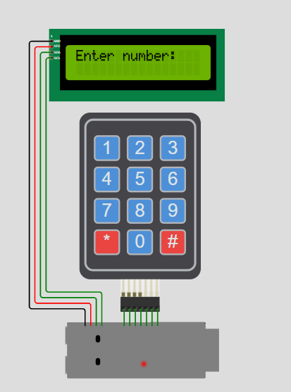
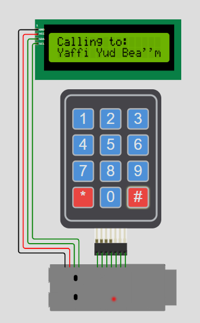

# Real-Time Phone Simulation

A real-time simulation of a digital toy phone system developed in **C++** utilizing **FreeRTOS** tasks. The system allows users to input phone numbers via a 4x3 Keypad, view the input dynamically on an I2C LCD display, perform a simulated call, and match numbers against a pre-defined local phone book.

## Features
* **Multi-Tasking Architecture:** Powered by **FreeRTOS** to handle user inputs and display updates concurrently via dedicated real-time tasks (`InputTask` and `EnterNumberTask`).
* **Dynamic Keypad Input:** Reads 4x3 keypad entries. Supports back-scrolling visual indicators (`...`) if the number exceeds the 16-character boundary of the LCD.
* **Local Phone Book Resolution:** Uses `std::map` to map entered phone numbers to contact names upon dialing.
* **Call Control States:** 
  * Press `#` to initiate a call.
  * Interactive prompts flashing instructions on the screen.
  * Press `*` to cancel an ongoing call or clear the current buffer.

---

## Simulation Screenshots

| System Idle / Number Input | Active Simulation Call |
| :---: | :---: |
|  |  |

---

## Hardware Configuration & Pinout

The project maps hardware components using the following I2C and GPIO definitions:

### I2C LCD Display (Address: `0x27`, 16x2 Columns/Rows)
* **SDA:** GPIO 14
* **SCL:** GPIO 13

### 4x3 Keypad Matrix
* **Row Pins (R1, R2, R3, R4):** GPIO 9, GPIO 46, GPIO 3, GPIO 8
* **Column Pins (C1, C2, C3):** GPIO 18, GPIO 17, GPIO 16

---

## Technical Architecture (FreeRTOS Tasks)

1. **`EnterNumberTask` (Priority 1):** Manages the top row of the LCD display. It continuously updates the instructions according to the phone's state (`Wait for input`, `Prompt to call/clean`, `Calling state`, or `Call Stopped`).
2. **`InputTask` (Priority 1):** Periodically polls the Keypad matrix for physical input. It appends numbers to the buffer, tracks the buffer size validation, and queries the `std::map` database when a call is initiated.

---

## How to Run the Project

### Option 1: Live Simulation
You can view and interact with the physical layout directly on Wokwi:
* [Live Wokwi Simulation](https://wokwi.com/projects/463973597513690113)

### Option 2: Manual Installation
1. Copy the C++ code from this repository into your local environment or target microcontroller project (e.g., ESP32 using Arduino Framework with FreeRTOS enabled).
2. Install the necessary libraries via your package manager:
   * `LiquidCrystal_I2C`
   * `Keypad`
3. Wire the components according to the **Pinout** configuration section above.
4. Build and flash the firmware to your microcontroller.

---

## Dependencies & Technologies
* **Language:** C++ (`std::string`, `std::map`)
* **OS Framework:** FreeRTOS
* **Core Libraries:** `<LiquidCrystal_I2C.h>`, `<Keypad.h>`, `<Wire.h>`
* **Platform:** Wokwi Simulator
