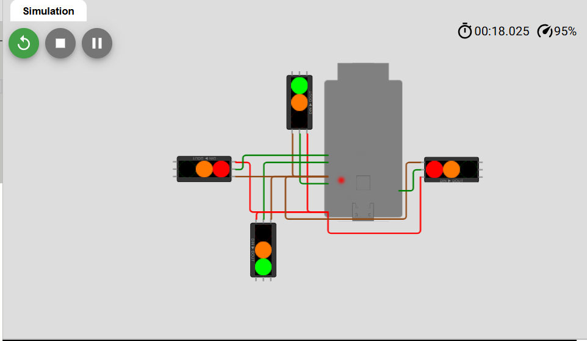

# Asynchronous Traffic Light Control System (NeoPixel & MicroPython)

A real-time, 4-way intersection traffic light system simulation developed in **MicroPython** and designed for the **Wokwi** platform. The project utilizes addressable **NeoPixel (WS2812B)** LED strips for the signals and runs on an asynchronous task runner framework via **`uasyncio`**.

## Features
* **Asynchronous Logic Execution:** Uses `uasyncio` to drive light transition cycles efficiently without blocking the system core execution.
* **Smart Intersect Management:** Simulates a realistic 4-direction traffic flow controller (Up, Down, Left, Right) that safely alternates green/red states between conflicting lanes.
* **Addressable NeoPixel Integration:** Every individual traffic signal consists of a 3-LED NeoPixel cluster representing Red, Yellow, and Green lights.
* **Smooth Transitions:** Automatically cycles through intermediate warning states (Yellow) before switching direction flows.

---

## Overview
This project simulates a fully functional traffic light management system. It is implemented using MicroPython, allowing for efficient and readable control logic suitable for microcontrollers.

---

## Hardware Configuration & Pinout

The system controls 4 independent traffic directions, mapped to the following microcontroller GPIO channels:

### NeoPixel Strip Arrays (3 LEDs per strip)
* **Left Strip (`strip_0`):** GPIO 27
* **Right Strip (`strip_1`):** GPIO 15
* **Down Strip (`strip_2`):** GPIO 14
* **Up Strip (`strip_3`):** GPIO 13

### Color & Index Mapping inside `changeColor()`
* **Index 0:** Red Light `(255, 0, 0)`
* **Index 1:** Yellow Light `(255, 120, 0)`
* **Index 2:** Green Light `(0, 255, 0)`

---

## Software Flow & States

The asynchronous execution follows a structured loop sequence inside `traffic_task()`:
1. **Transition Phase (2 Seconds):** All 4 directions blink or switch to their intermediate yellow warnings concurrently.
2. **Flow Phase (5 Seconds):** Dynamic orientation swap. While `Left` and `Right` lanes get Green indicators, `Up` and `Down` lanes are blocked with Red indicators, alternating on every cycle loop execution.

---

## How to Run the Project

### Option 1: Live Simulation
You can open and execute the simulation directly on your browser via Wokwi:
* [Live Wokwi Simulation](https://wokwi.com/projects/463746801980907521)

### Option 2: Local Deployment
1. Ensure your physical board or emulator has MicroPython firmware installed.
2. Save the source code file as `main.py`.
3. Connect 4 addressable NeoPixel arrays to GPIO pins 13, 14, 15, and 27 according to the pinout table.
4. Run the code using an IDE (like Thonny) or upload it to your board.

---

## Dependencies
* **Core Modules:** `machine.Pin`, `neopixel.NeoPixel`
* **Concurrency Engine:** `uasyncio`
* **Platform:** Wokwi Simulator

## Overview
This project simulates a fully functional traffic light management system. It is implemented using MicroPython, allowing for efficient and readable control logic suitable for microcontrollers.

<!-- החליפי את הנתיב image.png בנתיב האמיתי של הקובץ שהעלית לגיטהאב -->

