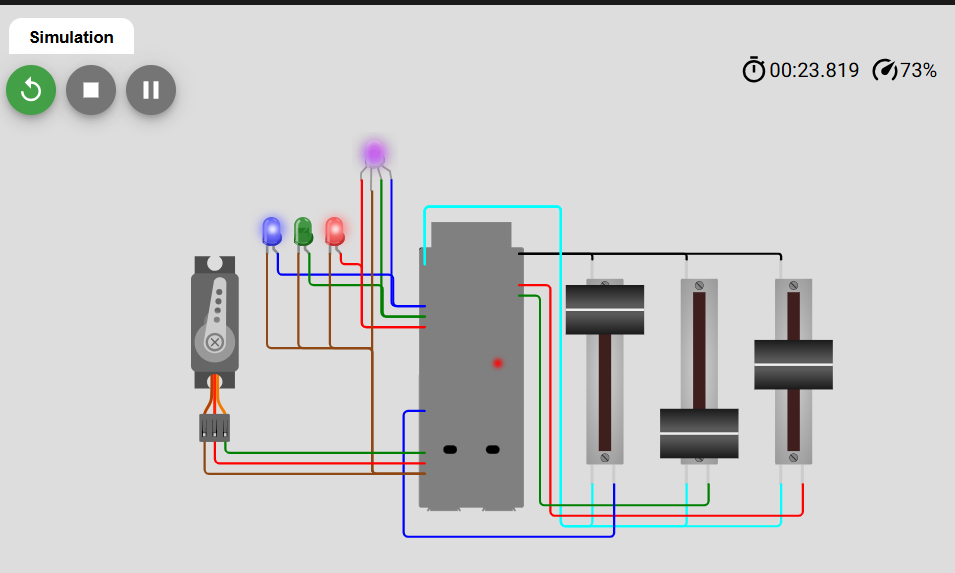

# Distance Measurement and Alert System

An embedded system project written in **MicroPython** that measures distance using an ultrasonic sensor and provides visual and audible alerts. The project is designed and simulated on the **Wokwi** platform.

## Overview
This project utilizes an HC-SR04 ultrasonic distance sensor to monitor proximity. Based on the measured distance, the system triggers different alert levels using LEDs and a buzzer (piezo), making it ideal for applications like parking assistants or proximity warning systems.

## How to Run the Project

You can interact with and run this simulation in two ways:

### Option 1: View the Existing Simulation
You can view and run the project directly through Wokwi by visiting the following link:
* [Live Wokwi Simulation](https://wokwi.com/projects/463835551380306945)

### Option 2: Run in Your Own Wokwi Project
If you prefer to set up the simulation in your own workspace, follow these steps:
1. Copy the MicroPython source code from the repository.
2. Go to [Wokwi](https://wokwi.com/) and create a new project.
3. Paste the code into the `main.py` file.
4. Configure the diagram components (HC-SR04 sensor, LEDs, resistors, and buzzer) according to the project layout and click **Start Simulation**.

## Components & Technologies Used
* **Language:** MicroPython
* **Sensor:** HC-SR04 Ultrasonic Distance Sensor
* **Outputs:** LEDs (Visual Indicator) & Buzzer (Audio Alerts)
* **Platform:** Wokwi Simulation Tool
