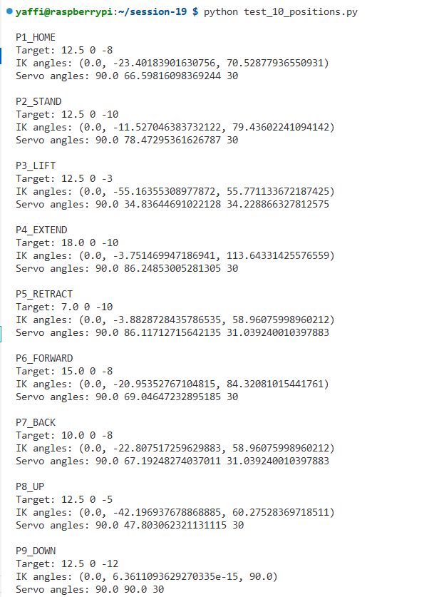

# Session 19 – Inverse Kinematics for One Leg

## Overview

This session focuses on implementing **Inverse Kinematics (IK)** for one robotic leg.

The goal is to calculate the required joint angles based on a target foot position `(x, y, z)`.

The IK solver converts a target foot position into three joint angles:

* Hip angle
* Femur angle
* Tibia angle

The calculated geometric angles are then converted into physical servo angles.

---

## Project Structure

```text
session-19/
│
├── ik_solver.py
├── test_ik.py
├── test_10_positions.py
├── ik_test_results.csv
├── Screenshot_session_19.png
└── README.md
```

---

## Inverse Kinematics Solver

The `ik_solver.py` file contains the main IK implementation.

The function:

```python
leg_ik(x, y, z)
```

receives the target foot position and calculates:

```text
Hip angle
Femur angle
Tibia angle
```

The leg dimensions used in the calculations are:

```python
L1 = 2.5
L2 = 10.0
L3 = 12.0
```

Where:

* `L1` represents the Coxa length.
* `L2` represents the Femur length.
* `L3` represents the Tibia length.

If the requested position cannot be reached by the leg, the function returns:

```python
None
```

---

## Servo Angle Mapping

The function:

```python
ik_to_servo(hip_deg, femur_deg, tibia_deg)
```

converts the geometric IK angles into physical servo angles.

The servo angles are limited to safe operating ranges.

---

## Testing Known Positions

The `test_ik.py` file tests five predefined foot positions:

* HOME
* STAND
* LIFT
* EXTEND
* RETRACT

For every position, the program:

1. Calculates the IK angles.
2. Checks whether the position is reachable.
3. Converts the IK angles to servo angles.
4. Prints the results to the terminal.

Run the test with:

```bash
python test_ik.py
```

---

## Testing 10 Foot Positions

The `test_10_positions.py` file tests 10 different target foot positions.

The tested positions include:

* HOME
* STAND
* LIFT
* EXTEND
* RETRACT
* FORWARD
* BACK
* UP
* DOWN
* SIDE

For every reachable position, the program calculates:

* Target coordinates `(x, y, z)`
* Hip angle
* Femur angle
* Tibia angle
* Hip servo angle
* Femur servo angle
* Tibia servo angle

Run the test with:

```bash
python test_10_positions.py
```

---

## Unreachable Position Testing

The program also tests five unreachable positions.

The purpose of this test is to verify that the IK solver correctly detects positions outside the physical range of the leg.

Expected output:

```text
OK - unreachable detected
```

The test verifies that the program handles invalid positions without crashing.

---

## CSV Logging

The calculated IK and servo results are saved to:

```text
ik_test_results.csv
```

The CSV file contains the following columns:

```text
name
x
y
z
hip_deg
femur_deg
tibia_deg
servo_hip
servo_femur
servo_tibia
status
```

This allows the IK results to be reviewed and compared after the program finishes running.

---

## Test Results Screenshot

The following screenshot shows the terminal output from the Session 19 IK tests:



---

## Run the Project

Navigate to the Session 19 directory:

```bash
cd ~/session-19
```

Run the known-position test:

```bash
python test_ik.py
```

Run the 10-position and unreachable-position tests:

```bash
python test_10_positions.py
```

---

## Session 19 Results

The completed implementation successfully:

* Calculates IK angles from `(x, y, z)` foot coordinates.
* Converts geometric IK angles into servo angles.
* Tests five predefined positions.
* Tests 10 different foot positions.
* Detects unreachable positions.
* Handles unreachable targets without crashing.
* Saves test results to a CSV file.
* Prepares servo angle data for future integration.

---

## Conclusion

Session 19 successfully implements an Inverse Kinematics solver for one robotic leg.

The program converts target foot coordinates into joint angles, maps the calculated angles to servo angles, verifies multiple reachable and unreachable positions, and saves the results to a CSV file.

The IK solver provides the foundation for future robotic leg movement and full robot control.
